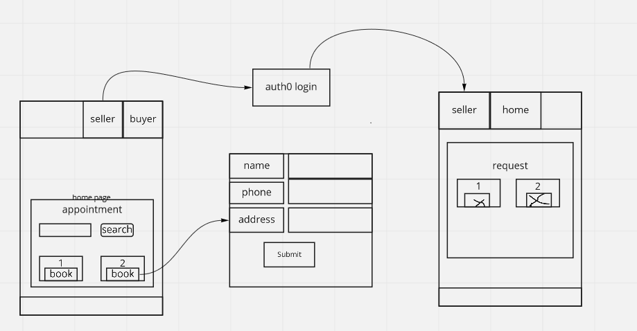

# Book Appointment Project

In the project directory, you can run:

### `npm start`

### `npm test`

### `npm run build`

### `npm run eject`

>Note: if you want to run this code :
1. Create .env file.
2. paste REACT_APP_URL=URL=https://task-book-bakend.herokuapp.com
3. and paste REACT_APP_AUTH0_DOMAIN = dev-ivklt7fq.us.auth0.com
4. paste REACT_APP_AUTH0_CLIENT_ID= QjJHw0RcujdgscF8bnJNNaiaUE4hpFP6
5. also specify the PORT
6. paste the api in REACT_APP_URL=URL=YOUR_API

>I used Reactjs to configure this project  

[REACT DOCUMENTATION](https://reactjs.org/docs/getting-started.html)

> Design Decisions

1. First I painted a wireframe :

2. I used [Bootstrap](https://react-bootstrap.netlify.app/) in some component.

3. I generate a css file and use it in all components. 

>Highlights and lessons learn

1. If I have more time I'll add pagination fro appiontment cards and add some features.
 2. I learnt from this application how to manage time and plan how to do the application.

 
